<h1 align="center">Enterprise LAN Security Assessment</h1>

<p align="center">
  <b>Multi-LAN Enterprise Network Design, Routing, Protocol Security, and Vulnerability Analysis using Cisco Packet Tracer</b>
</p>

<p align="center">
  <i>Designed and documented as part of Lab 04 for enterprise network architecture and cybersecurity assessment.</i>
</p>

---

## Overview

This project demonstrates the design, implementation, and security assessment of a multi-site enterprise network using Cisco Packet Tracer.

The lab environment was designed with three separate LAN segments connected through routers and switches. It includes IP addressing, static routing, MAC address verification, connectivity testing, HTTP and HTTPS testing, SSH access testing, and Shellshock vulnerability analysis.

The purpose of this project was to understand how enterprise networks are built, how traffic moves between devices, and how insecure services can be abused by attackers in real-world environments.

---

## Objectives

- Build a multi-LAN enterprise topology in Cisco Packet Tracer
- Configure routers, switches, PCs, and a server
- Assign IP addresses and default gateways
- Configure static routes between all LAN segments
- Verify connectivity using ping testing
- Examine switch MAC address tables
- Compare HTTP vs HTTPS
- Compare SSH vs Telnet
- Compare TCP vs UDP
- Demonstrate and analyze the Shellshock vulnerability
- Recommend mitigation strategies and security improvements

---

## Tools and Technologies

- Cisco Packet Tracer
- IPv4 Addressing
- Static Routing
- SSH
- HTTP
- HTTPS
- TCP / UDP
- Switch MAC Address Tables
- Bash CGI / Shellshock Demonstration
- GitHub
- Markdown

---

## Skills Demonstrated

- Enterprise network design
- IP addressing and subnetting
- Static route configuration
- Router and switch troubleshooting
- Network connectivity validation
- Secure remote administration
- Protocol security analysis
- Vulnerability awareness
- Technical documentation
- GitHub portfolio organization

---

## Network Topology

The network contains three enterprise LAN segments:

| Network | Subnet |
|---|---|
| IT Network | 10.1.10.0/24 |
| OT Network | 192.168.50.0/24 |
| Remote Network | 172.16.5.0/24 |

### Devices Used

- 3 Routers
- 3 Switches
- 6 PCs
- 1 Server

### Topology Screenshot


---

## Routing Configuration

Static routes were configured on all routers so that each LAN segment could communicate with the others successfully.

### Router Interface and Routing Evidence

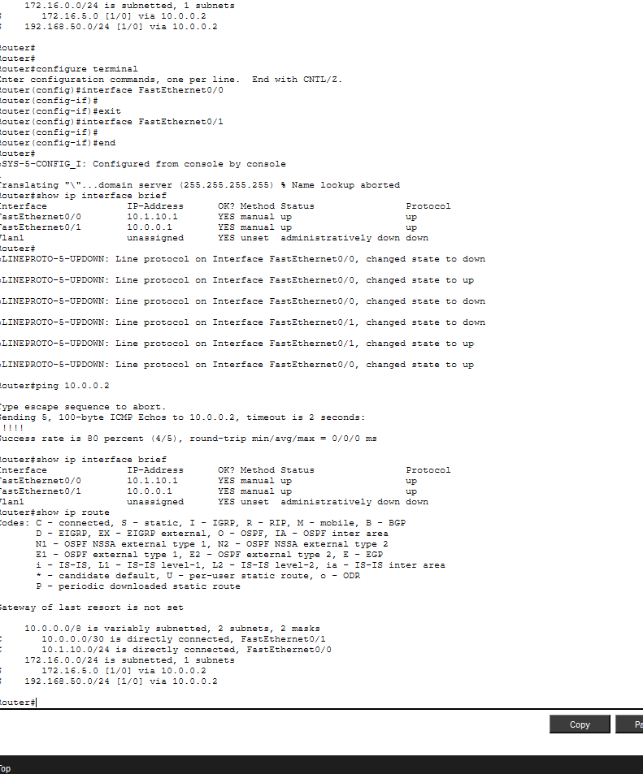

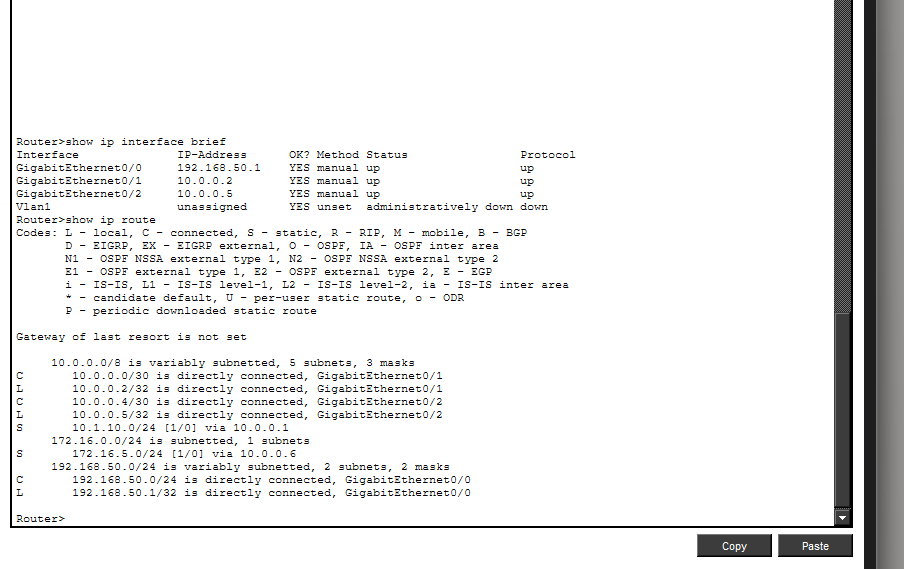

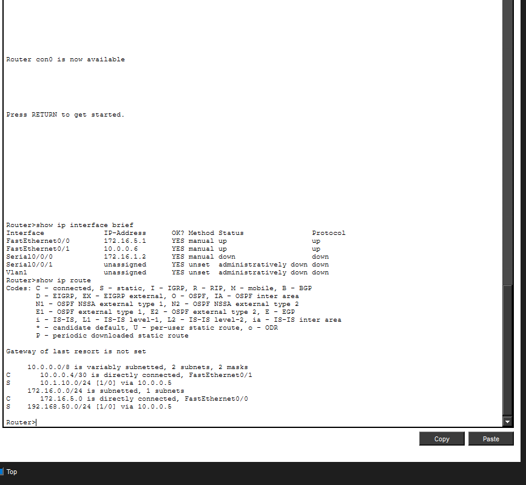

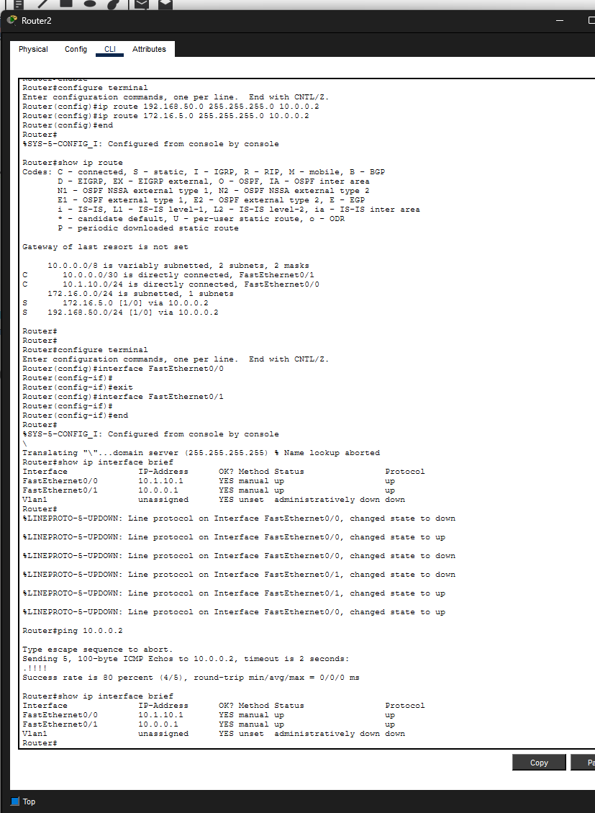

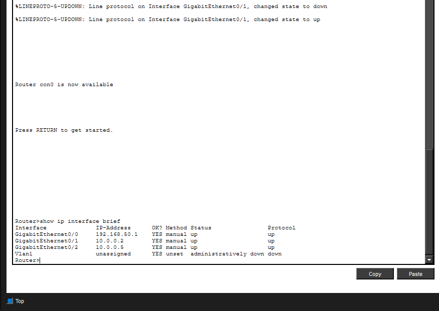

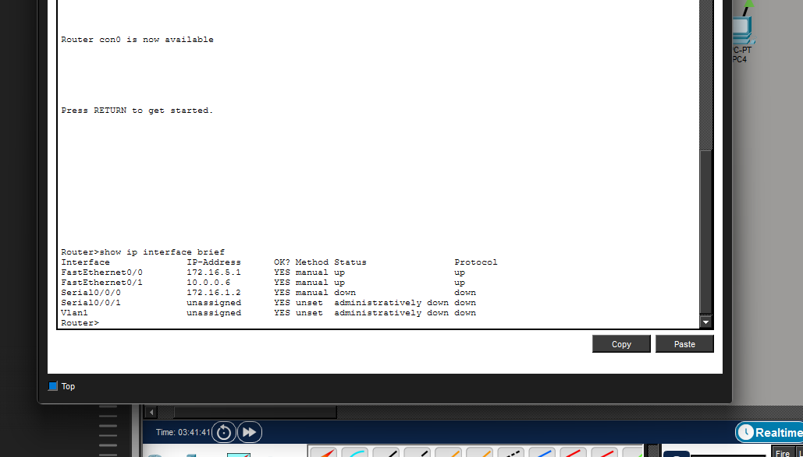

---

## Layer 2 Verification

The switch MAC address table was used to confirm that the switch learned the MAC addresses of connected hosts and could correctly forward frames inside the LAN.

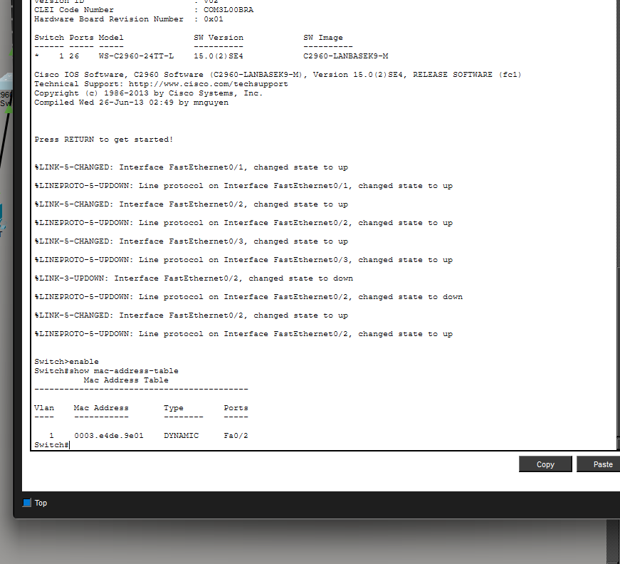

---

## Connectivity Testing

Connectivity was verified between:

- PCs and their default gateways
- Devices within the same LAN
- Devices across different LAN segments
- End hosts and the OT server

Successful ping results confirmed that routing and inter-network communication were working correctly.

---

## HTTP and HTTPS Testing

The OT server was used to test web communication.

### HTTP Evidence

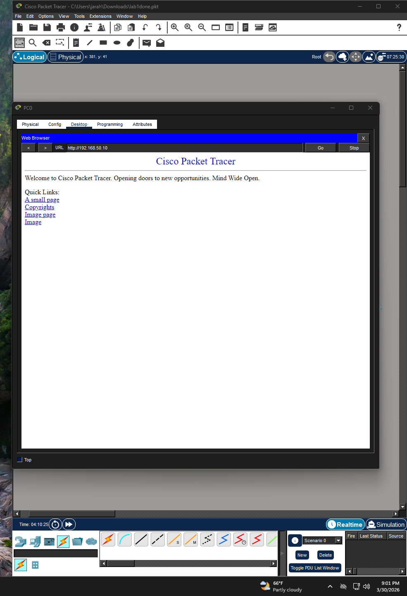

### HTTPS Evidence

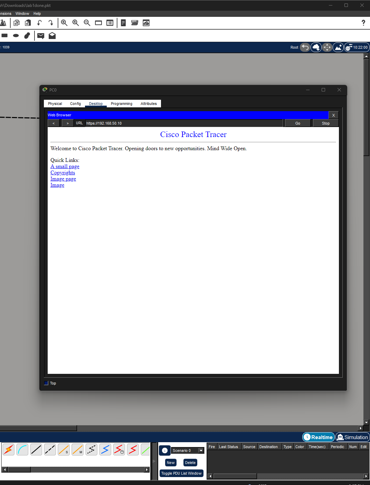

### HTTP vs HTTPS

| HTTP | HTTPS |
|---|---|
| Plaintext communication | Encrypted communication |
| Uses port 80 | Uses port 443 |
| Easier to intercept | More secure against interception |
| No TLS protection | Uses TLS/SSL protection |

HTTPS is the more secure protocol because it protects confidentiality and integrity during transmission.

---

## SSH Testing

SSH was used to demonstrate secure remote access to network devices.

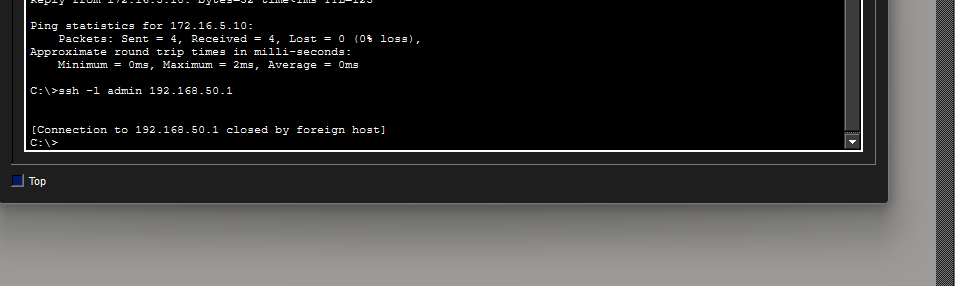

### SSH vs Telnet

| SSH | Telnet |
|---|---|
| Encrypted | Plaintext |
| Protects credentials | Credentials can be intercepted |
| Secure for enterprise use | Insecure for modern environments |
| Preferred for administration | Deprecated for secure management |

SSH is preferred in enterprise environments because it protects both login credentials and the remote management session.

---

## TCP vs UDP

| TCP | UDP |
|---|---|
| Connection-oriented | Connectionless |
| Reliable delivery | Faster but less reliable |
| Uses session setup | No session handshake |
| Better for secure monitored communication | Lower visibility for tracking sessions |

### Examples in this Lab

- TCP: HTTP, HTTPS, SSH
- UDP: SNMP concept discussion

TCP provides greater security visibility because it uses a three-way handshake and supports session tracking, while UDP does not establish a formal connection.

---

## Shellshock Vulnerability Demonstration

This lab also included a Shellshock vulnerability demonstration attempt.

The Shellshock exploit targets vulnerable Bash CGI scripts on Linux web servers. A specially crafted HTTP request can cause a vulnerable Bash process to execute attacker-supplied commands remotely.

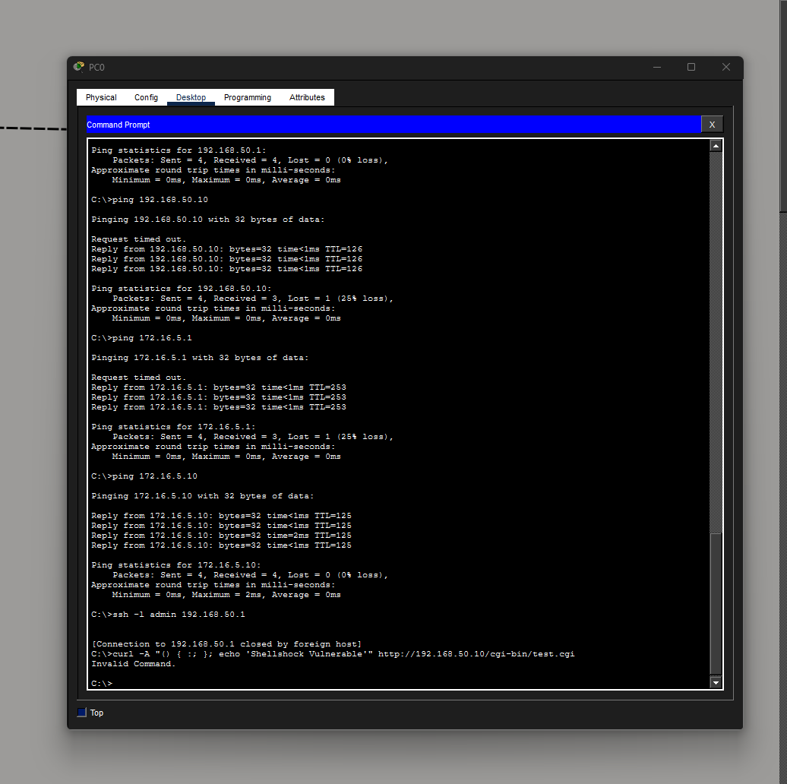

### Potential Impact

- Unauthorized remote access
- Command execution on the OT web server
- Data theft
- Malware installation
- Lateral movement into OT systems
- Possible disruption of SCADA-related operations

### Recommended Mitigations

- Patch Bash immediately
- Disable unnecessary CGI scripts
- Restrict remote administrative access
- Segment OT and IT environments
- Use firewalls and IDS/IPS solutions
- Monitor logs for suspicious requests and commands

---

## OSI Layer Mapping

| OSI Layer | Example from Lab |
|---|---|
| Layer 1 – Physical | Cables, routers, switches, PCs |
| Layer 2 – Data Link | Switch MAC address table |
| Layer 3 – Network | IP addressing and static routing |
| Layer 4 – Transport | TCP and UDP |
| Layer 7 – Application | HTTP, HTTPS, SSH |

---

## Key Takeaways

This project highlighted the importance of:

- Proper enterprise network segmentation
- Correct IP addressing and static routing
- Secure management protocols such as SSH
- Secure web communication using HTTPS
- Understanding how vulnerabilities such as Shellshock can affect enterprise services
- Strong documentation and evidence collection for security reporting

The lab also demonstrated that a single vulnerable service can create a path for lateral movement across multiple systems if security controls are weak.

---

## Repository Structure

```text
Enterprise-LAN-Security-Assessment/
│
├── README.md
├── Lab04-Enterprise-LAN-Security-Report.pdf
│
└── proof/
    ├── topology.png
    ├── route1.png
    ├── route2.png
    ├── route3.png
    ├── brief1.png
    ├── brief2.png
    ├── brief3.png
    ├── MACaddress.png
    ├── http.png
    ├── https.png
    ├── SSH.png
    └── Shellshock.png